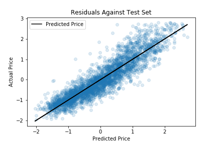
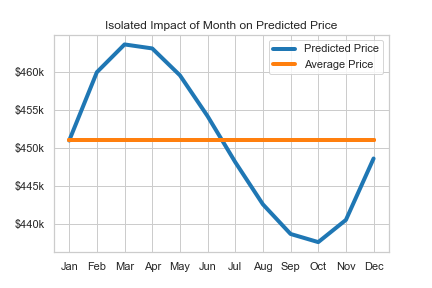
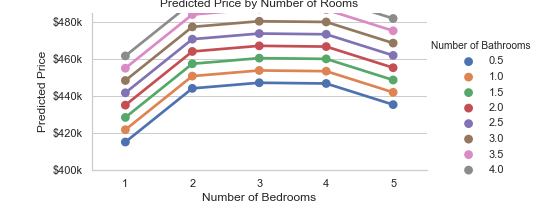
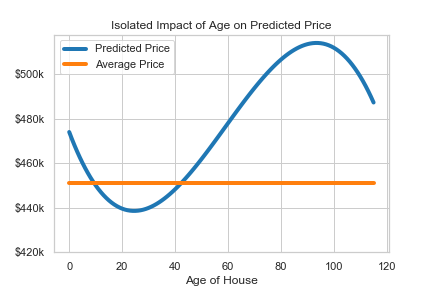

# Module 2 Final Project

The task is to use data from the King County housing market to make a model that can predict housing prices. In order to determine the most valuable ways to use this model I broke the questions of this project into three groups.

## Housing Valuation
This model will be able to assist real estate professionals assess the value of homes, marketing efforts, and even undeveloped land. To demonstrate the potential of this model, this analysis will focus on:
- The impact of month on price of sale
- The impact of number of interested buyers on price of sale

## Renovation Advice
This model will be able to assist homeowners and real estate developers predict the efficacy of remodeling. To demostrate this component of the tool, this analysis will also investigate:
- Whether renovation has significant impact overall, and if so to what extent
- If making an addition to the home, what is the impact of increased square footage on the price?
- If making an addition, what kind of rooms would be most beneficial to add?

## Investment Guidance
This model will also be able to assist investors in targeting homes that are most likely to increase in value. To demonstrate this capacity, this analysis will investigate:
- the impact of age on the price of a house

# Description of Data
The data contained 21597 entries with data on houses sold in King County during 2014 and 2015. Sale prices in the set range from $78,000 to $7,700,000 with a mean of $540,296, median of $450,000 and standard deviation of $367,368.  

During data exploration I found outlier values and tested for linearity of the relationship between the independent variables and the dependent variables.

### Notable Findings:
- A relatively small number of houses with extremely large prices were skewing the sample.
- Lot Square footage does not appear to have a significant relationship with price after accounting for outliers and will be removed from the analysis. 
- Condition has no apparent relationship with price and will be dropped from the analysis.
- Houses East of -121.783 degrees longitude were dropped from this analysis because they accounted for only 1% of the data and were causing skew. All houses are within 32.16 miles of Seattle city center.

*--Note-- There is a very large sample of data with large lot sizes that has a noticably different relationship with price. Potentially, this is farm land or something like it. For future projects this slice of data could be useful for predicting more rural home values. Because these houses are so different I dropped these outliers even though I will  not be using lot size data in this analysis.

### Added Features
Based on the questions posed in the analysis, I chose to add these features to the data:
- Month the house was sold
- Age of the house at point of sale
- Number of years since the house has been renovated
- Whether the house had been renovated at all
- Distance from house to Seattle city center
- Nearest city data for the 5 largest cities in the county
- Square footage relative to nearest fifteen neighbors

Ultimately, for this analysis the data contained 16261 entries. Sale prices in the set range from $80,000 to $974,350 with a mean of $451,089 median of $420,000 and standard deviation of $185,546.

The data was split into a train test split with a test size of .2. To allow for reproducablity, the random state used for the split was 37.   

# Establish a Baseline Model
After standardizing the variables, the baseline model recorded an r-squared of (.7500) against the training set along with a MSE of (.2499). In 10-Fold KFold crossvalidation, it recorded an r-squared of (.7487). Against the test set, r-squared was (.7657) and the MSE was (.2348). The difference of (.0151) for the MSE of the training and test groups suggests that the model is not overfit.  

High impact variables included: dist_to_Seattle and WaterFront
Low impact variables included: floors

#### Model 1 Residuals Against Test Data

Based on the plot of residuals, it is clear that the model could be more generalizable, especially for high value homes.

# Train the Model
In order to train the model I used the following steps:
1. Find and included interactions.
2. Find and included polynomial relationships.
3. Selected for statistically significant variables.

## Interaction Features
Through an iterative process designed to find the interactions that most highly impacted the MSE of the model I determined 7 interaction features were worthy of inclusion in the final model. Full details can be found in the model training notebook. The general trend was geographic interactions. (e.g. as dist_to_Seattle and lat, which describes the fact that prices rise when approaching Seattle from the North or the South)  

After including the 7 interaction features, the model(model2)  recorded an r-squared of (.8009) against the training set along with a MSE of (.1990). In 10-Fold KFold crossvalidation, it recorded an r-squared of (.7993). Against the test set, r-squared was (.8147) and the MSE was (.1857). The difference of (.01331) for the MSE of the training and test groups suggests that the model is not overfit.

High impact Variables included: dist_to_Seattle, WaterFront, Federal Way, and long * Seattle
Low impact Variables included: long * dist_to_Seattle

#### Model2 Residuals Against Test Data

Based on the plot of residuals, there is improvement for high values homes, and residuals appear to be reduced. 

## Polynomial Features
Through an iterative process designed to find the polynomial relationships between the independent and dependent variables, I determined polynomial factors to include as features in the model. Full details can be found in the model training notebook. 

After including the new features, the model(model3)  recorded an r-squared of (.8337) against the training set along with a MSE of (.1605). In 10-Fold KFold crossvalidation, it recorded an r-squared of (.8296). Against the test set, r-squared was (.8398) and the MSE was (.1605). The difference of (.0057) for the MSE of the training and test groups suggests that the model is not overfit.

#### Model3 Residuals Against Test Data

Based on the plot of residuals, there is improvement for high values homes, and residuals appear to be reduced. 

## Variable Selection By P-Values
Through stepwise selection, I determined features that had statistically significant relationships at an alpha of .05. 

After excluding insignificant features, the model(model4)  recorded an r-squared of (.8315) against the training set along with a MSE of (.1684). In 10-Fold KFold crossvalidation, it recorded an r-squared of (.8294). Against the test set, r-squared was (.8389) and the MSE was (.1614). The difference of (.0070) for the MSE of the training and test groups suggests that the model is not overfit.

#### Model4 Residuals Against Test Data

Based on the plot of residuals, there is improvement for high values homes, and residuals appear to be reduced. 

# Analysis
To conduct analysis on each variable I isolated it's impact within the model by taking the average of every other category to fill the dataset, and looking at what happens to predicted price when only changing the target independent variable.

## Housing Valuation

The model predicts highest prices in the month of March, with a difference of $12,530 over the average prices of homes in the sample. The model predicts lowest prices in the month of October with prices falling a predicted $13,417.

The model predicts high degrees of price shifts with an increase in interested buyers. At four viewings the predicted price is $155,933 over the average price of homes in the sample, while at 0 viewings the predicted price is $3,252 below the average. 

The model predicts that renovation of any kind improves the value of a home by $18,824. Not renovating leads to a prediction $529 below the average price of homes in the sample. 

The model predicts that adding only 100 square feet of living space adds approximately $12,913 of value to a home, flattening off and peaking at 4738 square feet.

The model predicts that adding a second bedroom will increase the value of the home by $29,478. Adding additional bedrooms will contribute to the value of the home significantly less, and adding a fifth bedroom will actually decrease the value of the home. Adding an additional half-bathroom to any size home is predicted to increase the value by $6,781.

The model predicts that houses lose value for their first 24 years after being built. At that point, the prices then increase until peaking at 94 years old.